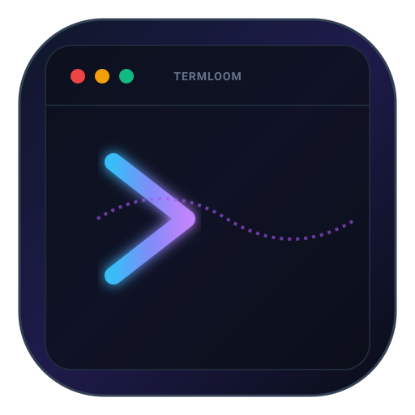

# TermLoom

<p align="center">
  
</p>

<p align="center">
  <strong>Cross-platform terminal session recorder and vector animator.</strong><br>
  Records raw terminal PTY streams into standalone CSS-animated SVGs, interactive HTML players, and Asciinema v2 recordings.
</p>

<p align="center">
  <a href="https://github.com/alexandrmotologa/termloom/blob/main/LICENSE-MIT"></a>
  <a href="https://github.com/alexandrmotologa/termloom/actions"></a>
  <a href="https://crates.io/crates/termloom"></a>
  
</p>

---

## Overview

TermLoom records terminal sessions directly from platform pseudo-terminals and outputs vector animations. It runs as a single static binary without Python or external runtime dependencies.

Terminal recording tools historically relied on POSIX pseudo-terminals (`pty`), leaving Windows developers dependent on WSL or third-party emulators. TermLoom binds to native Windows ConPTY on Windows systems and POSIX `openpty` on macOS and Linux.

The recorder captures ANSI escape sequences, 24-bit TrueColor palettes, Nerd Font symbols, and OSC 8 hyperlinks. Output animations are rendered as pure vector SVG files with embedded CSS keyframe animations, standalone HTML files with an interactive timeline, or Asciinema v2 (`.cast`) JSONL files.

## Highlights

* **Cross-platform PTY engine**: Uses native Windows ConPTY (`CreatePseudoConsole`) on Windows and POSIX `openpty` on Linux and macOS.
* **Vector animated SVG**: Generates zero-JavaScript SVGs with pure CSS `@keyframes` that scale cleanly on high-density displays.
* **Responsive color switching**: Embedded `@media (prefers-color-scheme: dark)` adapts SVG terminal colors to the viewer's system theme.
* **Interactive HTML player**: Single-file HTML output with timeline scrubbing, playback rate toggles (0.5x, 1x, 1.5x, 2x), and a one-click command copy button.
* **Visual frame deduplication**: Computes 64-bit visual hashes using xxHash to drop unchanged frames and collapse idle intervals.
* **Full terminal capability**: Supports 24-bit RGB colors, 256-color lookups, cursor positioning, font styles (bold, italic, underline, inverse), and OSC 8 hyperlinks.
* **Asciinema v2 compatibility**: Records `.cast` files directly and converts existing `.cast` files to animated SVGs or HTML players.

## Comparison

| Feature | TermLoom | termtosvg | asciinema |
| :--- | :--- | :--- | :--- |
| Implementation | Rust (single binary) | Python 3.5 (legacy) | Rust / Python |
| Windows ConPTY | Native support | No (POSIX only) | Partial (via WSL) |
| Output formats | SVG, HTML, Cast | SVG | Cast, SVG (via svg-term) |
| TrueColor (24-bit) | Supported | Limited | Supported |
| OSC 8 hyperlinks | Clickable links in SVG | Ignored | Ignored in SVG |
| Frame deduplication | xxHash 64-bit | Basic diff | None |
| Dark / light switching | CSS prefers-color-scheme | Fixed palette | Fixed palette |
| External runtime | None | Python runtime required | Node required for SVG |

## Installation

### From crates.io

```bash
cargo install termloom
```

### Pre-built binaries

Pre-compiled release binaries for Windows (x86_64), macOS (Apple Silicon and Intel), and Linux (x86_64, ARM64) are published on the [GitHub Releases](https://github.com/alexandrmotologa/termloom/releases) page.

### Building from source

```bash
git clone https://github.com/alexandrmotologa/termloom.git
cd termloom
cargo build --release
```

The resulting binary will be placed at `target/release/termloom` (or `target/release/termloom.exe` on Windows).

## Usage

### Recording an interactive session

To record an interactive shell session to an animated SVG:

```bash
termloom record demo.svg
```

This launches your default shell (`pwsh.exe` or `powershell.exe` on Windows, `$SHELL` on Unix). Type your commands normally. When finished, exit the shell (`exit` or `Ctrl+D`). TermLoom compresses the recording and writes the SVG.

### Recording with geometry and theme options

```bash
termloom record --cols 100 --rows 28 --theme catppuccin-mocha --max-wait 1.2 demo.svg
```

### Recording a non-interactive command

You can capture a specific command run without launching an interactive shell:

```bash
termloom record -c "cargo test" test_run.svg
```

### Exporting to an interactive HTML player

```bash
termloom record --format html player.html
```

Or pass a target filename ending in `.html`:

```bash
termloom record demo.html
```

### Recording to Asciinema v2 format

```bash
termloom record session.cast
```

### Converting existing `.cast` files

TermLoom can transform existing `.cast` files into animated vector SVGs or standalone HTML players:

```bash
termloom convert session.cast -o output.svg --theme dracula --window-style macos
termloom convert session.cast -o player.html --theme nord
```

## Command options

### `termloom record [OPTIONS] [OUTPUT]`

| Option | Default | Description |
| :--- | :--- | :--- |
| `-c, --command <CMD>` | Default shell | Specific command to execute instead of interactive shell |
| `--cols <COLS>` | `100` | Terminal column width |
| `--rows <ROWS>` | `28` | Terminal row count |
| `--theme <NAME>` | `catppuccin-mocha` | Color palette (`catppuccin-mocha`, `dracula`, `nord`, `tokyo-night`, `gruvbox-dark`, etc.) |
| `--window-style <STYLE>` | `macos` | Window frame (`macos`, `squircle`, `none`) |
| `--max-wait <SECS>` | `1.5` | Maximum idle interval between frames in seconds |
| `--format <FORMAT>` | auto | Explicit output format (`svg`, `html`, `cast`) |
| `--title <TEXT>` | `termloom` | Window title displayed in the frame header |
| `--font-family <FONTS>` | JetBrains Mono, ... | CSS font family sequence for SVG rendering |
| `--font-size <PX>` | `14` | Font size in pixels |

### `termloom convert [OPTIONS] <INPUT> -o <OUTPUT>`

| Option | Default | Description |
| :--- | :--- | :--- |
| `-o, --output <PATH>` | (required) | Output destination file path |
| `--theme <NAME>` | `catppuccin-mocha` | Palette name to apply |
| `--window-style <STYLE>` | `macos` | Window frame style |
| `--max-wait <SECS>` | `1.5` | Idle interval clamp in seconds |
| `--format <FORMAT>` | auto | Output format override (`svg`, `html`) |

## Built-in color palettes

TermLoom includes several curated color themes:

* `catppuccin-mocha` (default dark)
* `catppuccin-latte` (light)
* `dracula`
* `nord`
* `tokyo-night`
* `gruvbox-dark`
* `solarized-dark`
* `monokai`
* `one-dark`

For complete color definitions and customization details, see [docs/THEMES.md](docs/THEMES.md).

## Architecture

For an in-depth breakdown of the PTY subsystem, VTE grid state machine, and CSS keyframe generation algorithms, consult [docs/ARCHITECTURE.md](docs/ARCHITECTURE.md).

## Contributing

Contributions, issues, and pull requests are welcome. Review [CONTRIBUTING.md](CONTRIBUTING.md) for local development workflows and testing requirements.

## License

Dual-licensed under either:

* Apache License, Version 2.0 ([LICENSE-APACHE](LICENSE-APACHE))
* MIT License ([LICENSE-MIT](LICENSE-MIT))

at your option.
